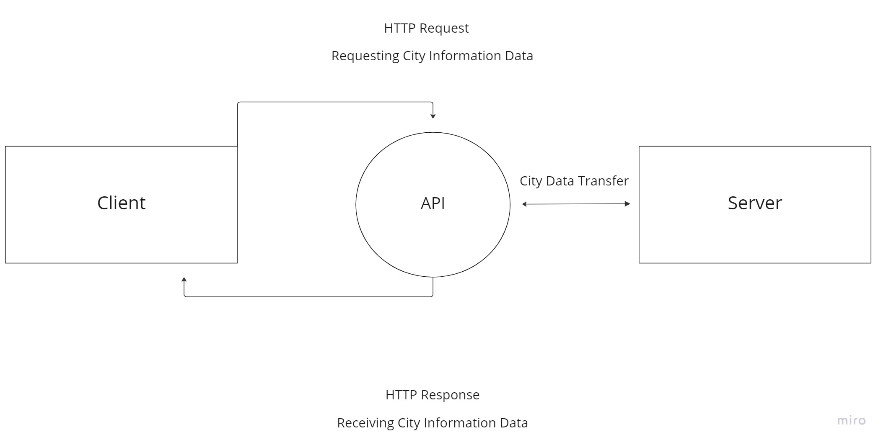

# City Explorer

**Author**: Matthew Austin
**Version**: 1.0.0

## Overview

This application is a city explorer that lets you search for U.S. cities and display their coordinates, as well as a static map image.

## Getting Started

[Live site](matt-austin-city-explorer.netlify.app)

## Architecture

This app is built with:

- JavaScript
- HTML5
- CSS3
- React
- React Bootstrap
- Axios
- Deployed on Netlify

### Location Explorer

The Location Explorer functionality allows a user to for U.S. cities and display their coordinates, as well as a static map image. The web-request-response cycle for this feature is shown below

## Change Log

1.0.0 - Initial deployment of location explorer feature

## Credit and Collaborations
<!-- Give credit (and a link) to other people or resources that helped you build this application. -->

## Feature Time Estimates

### Setup React Repo & API Keys

Estimate of time needed to complete: 30 minutes

Start time: 2023-01-24T20:56-08:00

Finish time: 2023-01-24T21:22-08:00

Actual time needed to complete: 26 minutes

### Locations

Estimate of time needed to complete: 1 hour

Start time: 2023-01-25T20:30-08:00

Finish time: 2023-01-25T21:22-08:00

Actual time needed to complete: 1 hour 22 minutes

### Map

Estimate of time needed to complete: 2 hours

Start time: 2023-01-25T21:30-08:00, 2023-01-26T14:30-08:00

Finish time: 2023-01-25T22:22-08:00, 2023-01-26T14:53-08:00

Actual time needed to complete: 1 hour 25 minutes

### Errors

Estimate of time needed to complete: 1 hour

Start time: 2023-01-26T15:00-08:00

Finish time: 2023-01-26T15:45-08:00

Actual time needed to complete: 45 minutes
