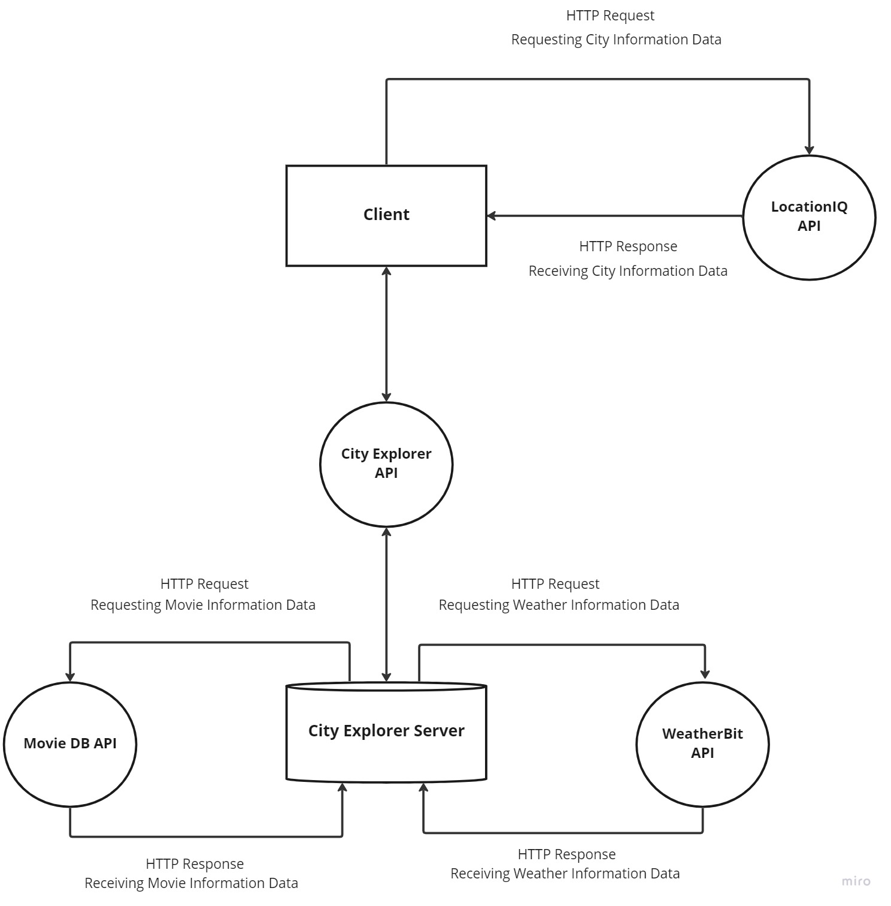

# City Explorer

**Author**: Matthew Austin
**Version**: 1.0.2

## Overview

This application is a city explorer that lets you search for U.S. cities and display their coordinates, as well as a static map image.

You are also able to check local weather data for three days based on a static set of data for a certain number of cities.

In addition, you can see movies that are related to the city in question, in no particular order.

## Getting Started

[Live site](matt-austin-city-explorer.netlify.app)

## Architecture

This app is built with:

- JavaScript
- HTML5
- CSS3
- React
- React Bootstrap
- Axios
- Deployed on Netlify
- [LocationIQ API](https://locationiq.com/)

The City Explorer functionality allows a user to for U.S. cities and display their coordinates, as well as a static map image. The web-request-response cycle for this feature is shown below

## Change Log

1.0.0 - 01-26-2023 9:00pm - Initial deployment of location explorer feature
1.0.1 - 01-28-2023 6:00pm - Deployment of static weather API capable server interface.
1.0.2 - 02-02-2023 7:50pm - Deployment of dynamic weather API and movie database API to display weather and movies for searched city.

## Feature Time Estimates

### Setup React Repo & API Keys

Estimate of time needed to complete: 30 minutes

Start time: 2023-01-24T20:56-08:00

Finish time: 2023-01-24T21:22-08:00

Actual time needed to complete: 26 minutes

### Locations

Estimate of time needed to complete: 1 hour

Start time: 2023-01-25T20:30-08:00

Finish time: 2023-01-25T21:22-08:00

Actual time needed to complete: 1 hour 22 minutes

### Map

Estimate of time needed to complete: 2 hours

Start time: 2023-01-25T21:30-08:00, 2023-01-26T14:30-08:00

Finish time: 2023-01-25T22:22-08:00, 2023-01-26T14:53-08:00

Actual time needed to complete: 1 hour 25 minutes

### Errors

Estimate of time needed to complete: 1 hour

Start time: 2023-01-26T15:00-08:00

Finish time: 2023-01-26T15:45-08:00

Actual time needed to complete: 45 minutes

### Weather Placeholder

Estimate of time needed to complete: 5 hours

Start time: 2023-01-28T13:00-08:00

Finish time: 2023-01-28T19:00-08:00

Actual time needed to complete: 5 hours

### Errors Revisited

Estimate of time needed to complete: 5 hours

Start time: 2023-01-28T13:00-08:00

Finish time: 2023-01-28T19:00-08:00

Actual time needed to complete: 5 hours

### Weather Live

Estimate of time needed to complete: 3 hours

Start time: 2023-02-01T16:30-08:00

Finish time: 2023-01-28T19:15-08:00

Actual time needed to complete: 3 hours, 15 minutes

### Movies

Estimate of time needed to complete: 2 hours

Start time: 2023-02-02T16:30-08:00

Finish time: 2023-01-28T17:30-08:00

Actual time needed to complete: 1 hour